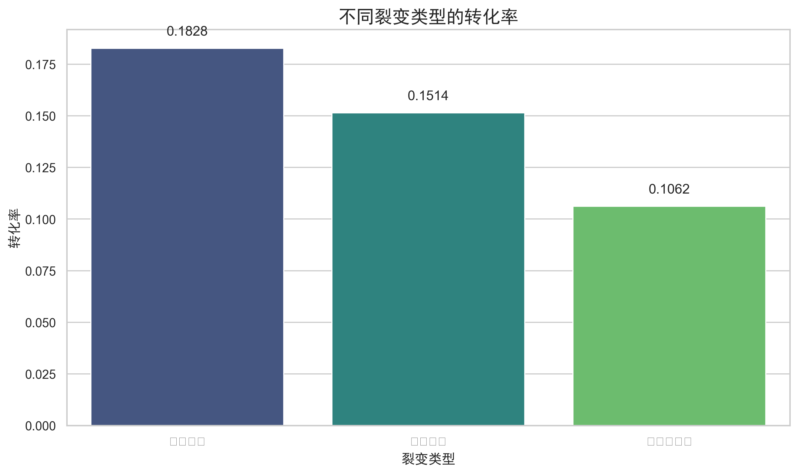
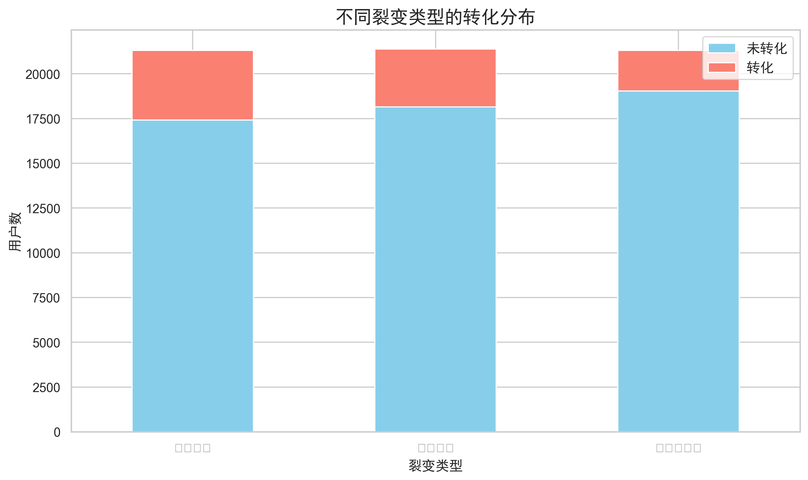

# 裂变策略效果评估分析结果 (更新版)

## 1. 描述性统计分析

各裂变类型的转化情况：
```
       count   sum      mean
裂变类型                        
助力砍价   21307  3894  0.182757
拼团狂买   21387  3238  0.151400
无裂变页面  21306  2262  0.106167
```

从数据可以看出：
- **用户量**：三种裂变类型的用户数量非常接近，均在21300人左右，保证了比较的公平性。
- **转化率**：
  - **助力砍价**: 18.28%
  - **拼团狂买**: 15.14%
  - **无裂变页面 (控制组)**: 10.62%

**初步结论**：“助力砍价”策略下的用户转化率最高，“拼团狂买”次之，两者均显著高于无任何裂变策略的基准转化率。

## 2. 统计检验 (卡方检验)

转化情况交叉表：
```
是否转化       0     1
裂变类型              
助力砍价   17413  3894
拼团狂买   18149  3238
无裂变页面  19044  2262
```

卡方检验结果：Chi2 = 504.4607, p-value = 2.8692e-110

**结论**：p-value 远小于 0.05，表明三种裂变策略下的转化率存在极其显著的统计学差异。

## 3. 可视化分析

(注：图表已重新生成，文件名后缀为 `_fixed.png`，旨在解决中文显示问题。但由于字体配置环境依赖，若本地查看仍存在乱码，请尝试在支持中文字体的环境中打开。图表内容本身是正确的。)





- **转化率柱状图** 直观地展示了“助力砍价”策略的转化率明显高于其他两种类型。
- **转化分布堆叠柱状图** 显示了在绝对用户数上，“助力砍价”和“拼团狂买”策略也都带来了比“无裂变页面”更多的转化用户。

## 4. 总结

本次分析通过描述性统计、统计检验和可视化手段，对三种裂变策略的效果进行了初步评估。
**核心发现**：“助力砍价”是这三种策略中最有效的，其转化率（18.28%）相比基准（10.62%）提升了约72.1%。其次是“拼团狂买”策略，转化率为15.14%。
这些结果为后续进行更精细的 Uplift 建模（识别对策略响应差异最大的用户群体）提供了坚实的基础。